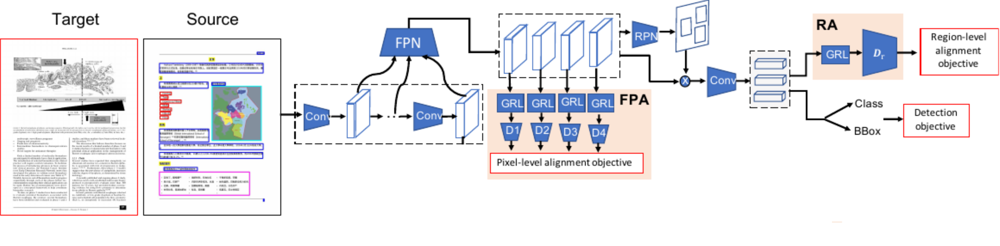

## Cross Domain Adaptation for Object Detection in Historical Art Sales Catalogs

Object detection in documents is a challenging task. It is even more difficult to train a
detector when only a fully unlabeled dataset is available. The performance of a trained
model depends heavily on the amount of labeled data. Also, it performs well when the
training (source) and test data (target) are sampled from the same distribution. If not,
the unsupervised domain adaptation (UDA) paradigm is a familiar way to minimize the
gap between them. In UDA, most approaches align the distributions between the source
and target images using an adversarial training loss. In this work, we followed UDA to
train a detector for the target domain using the labeled data from the source datasets
(_PubMed_ and _Chn_) and unlabeled data from the target domain (_WPI_). For detecting
document objects, text and figures, from historical art sales catalogs, we adopted three
different document object detection models. Since these models are trained on different
datasets, we modified their architectures to apply to the WPI data. We analyzed the
performance of these models on adapting the labeled _PubMed_ and _Chn_ dataset to the
unlabeled _WPI_ dataset. Our results show that alignment on the feature maps from a
backbone or feature pyramid network has the greatest impact on the datasets considered.
We also demonstrate that data augmentation techniques are comparable to domain
adaptation modules if the augmentations for the source dataset are selected according to
the target domain. Our best model with all DA modules can achieve an average precision
of 83.6% for detecting images; however, due to the wide-domain gap between the source
and target domains, the model performance in detecting the text is comparatively poor

*Cddod architecture followed in this work. Adapated from [[1]](https://arxiv.org/pdf/2003.13197.pdf)*


# Description
The aim of this project is to train an object detector for detecting _text_ and
_figure_ in the historical art sales catalogs from Wildenstein Plattner Institute (WPI). To achieve this,
we employed unsupervised domain adaptation (UDA) using two source datasets which are labeled (_PubMed_ and _Chn_). 
The architecture followed in this work is an adaptation from [[1]](https://arxiv.org/pdf/2003.13197.pdf). Most of the codes are adapted from PyTorch GitHub [repo](https://github.com/pytorch/vision/tree/c02d6ce17644fc3b1de0f983c497d66f33974fc6/torchvision/models/detection
). Parts of the code are adapted from  [K. Li et al. ](https://github.com/kailigo/cddod)[[1]](https://arxiv.org/pdf/2003.13197.pdf), 
which is based on [K. Saito et al.](https://github.com/VisionLearningGroup/DA_Detection)
[[2]](https://arxiv.org/pdf/1812.04798.pdf). We have rewritten codes from [[1]](https://arxiv.org/pdf/2003.13197.pdf) 
or [[2]](https://arxiv.org/pdf/1812.04798.pdf) using  PyTorch 1.11.0 version.


# Installation
## Prerequisites
We set up the environment using the following Python and PyTorch versions. Additional requirements can
be found in [requirements](src/requirements.txt) for setting up the enviornment.
* Python >= 3.8.10
* PyTorch >= 1.11.0, CUDA >= 11.3

## Tested enviornment
* RTX 3090,  RTX 2080Ti
* GTX 1080Ti
* Titanx (Pascal), GTX TitanX

## Project folder contents
In this project, we followed the project template from Hasso Plattner Institute 
[[link]](https://gitlab.hpi.de/deeplearning/students/project-template). Most of the 
contents below are just a reproduction of the original project template. The 
contents of the project folder are the following. 
* Config file folder for installation: [config](config)
* Installation scripts (enroot): [install](install)
* Management scripts (slurm): [scripts](scripts)
* Training and model code: [src](src)
* Experimental results, model checkpoints, and log files: [runs](runs) 


## Running on a cluster using slurm
We use different GPUs on a compute cluster using SLURM. Please follow the following steps to 
run the experiments with the help of SLURM on a cluster.

### 1. Configurations
* The [config](config) folder contains configuration files. The default config file is always
sourced before every script. In addition, you can create one file per host, that matches the exact
hostname to provide host specific configuration. For example, for configuring the data
directory [YOUR DATA DIRECTORY] on two different machines with hostnames _xyz_ (_config/xyz_)
and _abc_ (_config/abc_).

### 2. Installation (Build with enroot)
* For installation, start from an image from dockerhub and install dependencies with enroot.
The script [./scripts/build-image-enroot.sh](./scripts/build-image-enroot.sh) 
(or in short [./scripts/build-image.sh](./scripts/build-image.sh)) builds the enroot 
image in enroot. It starts from the configured BASE_IMAGE (in [config/default](config/default)) and 
runs [./install/00_install.sh](./install/00_install.sh) (this file is very similar to a Dockerfile). 

## On a python virtual enviornment
Please create a  virtual environment of python using conda or virtualenv and install all 
required [dependencies](./src/requirements.txt) . As an example, please follow the following 
steps to create a virtual enviornment using _virtualenv_ in python. 

```
$ mkdir my_python_env
$ python3 -m venv my_python_env/
$ source my_python_env/bin/activate
$ pip install -r requirements.txt 
```

## Dataset preparation
### 1. Download the datasets
   * Download the "_Chs_" and "_PubMed_" 
     datasets [here](https://drive.google.com/file/d/1m4ns2gbl3d4fcms5Ta6IS80g964sn_b2/view?usp=sharing).
   * The _WPI_ datasets can be downloaded from [here](https://digitalprojects.wpi.art/auctions). 
### 2. Organise the datasets in  "Pascal_VOC" format
   * "_Chs_" and "_PubMed_" have already been organized in the  Pascal VOC format. Please follow the same procedure for the
     _WPI_ dataset. Your directory should be looking like below
    
        ```
        $ cd WPI/
        $ ls
        Annotations  ImageSets  JPEGImages
        $ cat ImageSets/Main/train.txt
        3384827.jpg
        3384828.jpg
        3384829.jpg
        .
        .
        .
        ```
     
        The tree structure of the dataset directory should  be similar to this
       
        ```
        cddod/
        └── datasets/
           └── PubMed/
                ├── Annotations/
                ├── ImageSets/
                    ├── Main
                        ├── train.txt/
                        ├── trainval.txt/
                        └── test.txt/
                └── JPEGImages/
                
            └── Chn/
                ├── Annotations/
                ├── ImageSets/
                    ├── Main
                        ├── train.txt/
                        ├── trainval.txt/
                        └── test.txt/
                └── JPEGImages/
                    
            └── WPI/
                ├── Annotations/
                ├── ImageSets/
                    ├── Main
                        ├── train.txt/
                        └── test.txt/
                └── JPEGImages/              
        ````
## Configure experiments

### 1. Write your data path in config (yaml) files

* Write your dataset directories' paths in [config](./src/config).

### 2. Configure experimental parameters
For configuring experiment parameters, please refer to [default_config](src/default_config.py). Please change the parameters
according to your experiments. 
### 3. Weight & Biases
We used weight and biases (_wandb_) for experiment tracking. However, this is optional for training. 
If you use _wandb_, please give a _project_name_ and other _initialization parameters_. If there are any
doubts on the _wandb_ _initialization parameters_  used in the [config](src/config) files, please refer to the well-documented
_wandb_ [documentation](https://docs.wandb.ai/ref/python/init).

## Training

An example configuration for each experiment can be found in the [src/config](src/config) folder.
These yaml files are passed as an argument (_--config_) for training/testing. Please follow the structure and adapt
the arguments of these config files according to the experiments presented in the report. Below we are
giving two examples how to run experiments on a cluster using SLURM or on a local machine.

* Domain adaptation from _Chn_ dataset (source) to _WPI_ dataset (target)
    * On a cluster using slurm management
      ```
      NAME='YOUR_EXPERIMENT_NAME' ./scripts/quick-submit.sh -w name_of_slurmnode -- python fasterrcnn_fpn_fpa_ra.py --config "config/chn2wpi.yml" 
      ```
    * In a virtual enviornment (locally)
      ```
      python fasterrcnn_fpn_fpa_ra.py --config "config/chn2wpi.yml" 
      ```

* Domain adaptation from _PubMed_ dataset (source) to _WPI_ dataset (target)
    * On a cluster using slurm management
      ```
      NAME='YOUR_EXPERIMENT_NAME' ./scripts/quick-submit.sh -w name_of_slurmnode -- python fasterrcnn_fpn_fpa_ra.py --config "config/pubmed2wpi.yml" 
      ```
    * In a virtual enviornment (locally)
      ```
      python fasterrcnn_fpn_fpa_ra.py --config "config/pubmed2wpi.yml" 
      ```

## Git LFS
The pretrained models are stored in the repo using Git large file storage (Git LFS). Please 
follow the following steps to pull the repo using Git-LFS. For more information, please refer to Git LFS 
[documentation](https://git-lfs.github.com/).

```
git lfs install
git lfs pull 
```

## References

1. K.Saito et al. Strong-Weak Distribution Alignment for Adaptive Object Detection, CVPR 2019
   [[link]](https://arxiv.org/pdf/1812.04798.pdf).
2. K. Li et al. Cross-Domain Document Object Detection: Benchmark Suite and Method, CVPR 2020,
   [[link]](https://arxiv.org/pdf/2003.13197.pdf)

